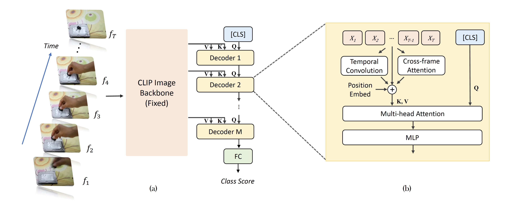
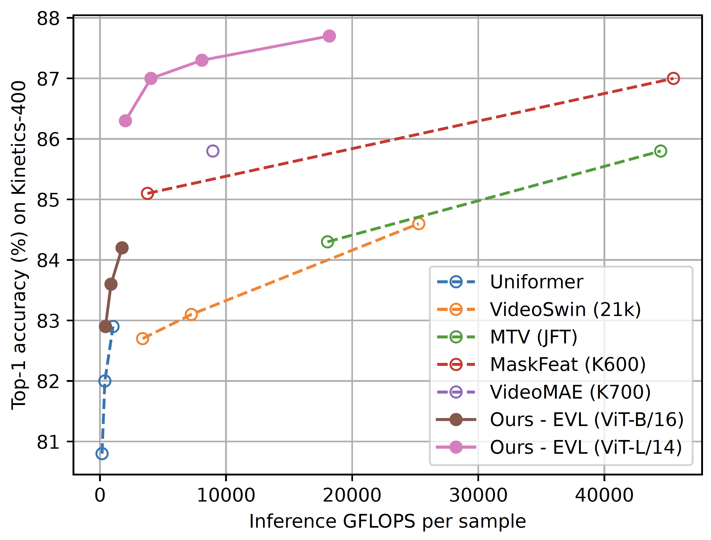

# Frozen CLIP models are Efficient Video Learners

This is the official implementation of the paper [Frozen CLIP models are Efficient Video Learners](https://arxiv.org/abs/2208.03550)

```
@article{lin2022frozen,
  title={Frozen CLIP Models are Efficient Video Learners},
  author={Lin, Ziyi and Geng, Shijie and Zhang, Renrui and Gao, Peng and de Melo, Gerard and Wang, Xiaogang and Dai, Jifeng and Qiao, Yu and Li, Hongsheng},
  journal={arXiv preprint arXiv:2208.03550},
  year={2022}
}
```

## Introduction

The overall architecture of the EVL framework includes a trainable Transformer decoder, trainable local temporal modules and a pretrained, fixed image backbone
(CLIP is used for instance).



Using a fixed backbone significantly saves training time, and we managed to train a ViT-B/16 with 8 frames for 50 epochs in 60 GPU-hours (NVIDIA V100).

Despite with a small training computation and memory consumption, EVL models achieves high performance on Kinetics-400. A comparison with state-of-the-art methods
are as follows



## Installation

We tested the released code with the following conda environment

```
conda create -n pt1.12.0cu11.6_official -c pytorch -c conda-forge pytorch=1.12.0 cudatoolkit=11.6 torchvision av
```

## Data Preparation

We expect that `--train_list_path` and `--val_list_path` command line arguments to be a data list file of the following format
```
<path_1> <label_1>
<path_2> <label_2>
...
<path_n> <label_n>
```
where `<path_i>` points to a video file, and `<label_i>` is an integer between `0` and `num_classes - 1`.
`--num_classes` should also be specified in the command line argument.

Additionally, `<path_i>` might be a relative path when `--data_root` is specified, and the actual path will be
relative to the path passed as `--data_root`.

The class mappings in the open-source weights are provided at [Kinetics-400 class mappings](data/k400_class_mappings.json)

## Backbone Preparation

CLIP weights need to be downloaded from [CLIP official repo](https://github.com/openai/CLIP/blob/d50d76daa670286dd6cacf3bcd80b5e4823fc8e1/clip/clip.py#L30)
and passed to the `--backbone_path` command line argument.

## Script Usage

Training and evaliation scripts are provided in the scripts folder.
Scripts should be ready to run once the environment is setup and 
`--backbone_path`, `--train_list_path` and `--val_list_path` are replaced with your own paths.

For other command line arguments please see the help message for usage.

## Kinetics-400 Main Results

This is a re-implementation for open-source use. Checkpoints and scripts will be released soon.

| Backbone | Decoder Layers | #frames x stride | top-1 | top-5 | Script | Model |
| - | - | - | - | - | - | - |
| ViT-B/16 | 4 | 8 x 16 | 82.9 | 95.7 | | |
| ViT-B/16 | 4 | 16 x 16 | 83.6 | 96.3 | | |
| ViT-B/16 | 4 | 32 x 8 | 84.2 | 96.6 | | |
| ViT-L/14 | 4 | 8 x 16 | 86.3 | 97.2 | | |
| ViT-L/14 | 4 | 16 x 16 | 87.0 | 97.6 | | |
| ViT-L/14 | 4 | 32 x 8 | 87.3 | 97.7 | | |
| ViT-L/14 (336px) | 4 | 32 x 8 | 87.7 | 97.8 | | |

## Data Loading Speed

As the training process is fast, video frames are consumed at a very high rate.
For easier installation, the current version uses PyTorch-builtin data loaders.
They are not very efficient and can become a bottleneck when using ViT-B as backbones.
We provide a `--dummy_dataset` option to bypass actual video decoding for training speed measurement. 
The model accuracy should not be affected. 
Our internal data loader is pure C++-based and does not bottleneck training by much on a machine with 2x Xeon Gold 6148 CPUs and 4x V100 GPUs.


## Acknowledgements

The data loader code is modified from [PySlowFast](https://github.com/facebookresearch/SlowFast). Thanks for their awesome work!
